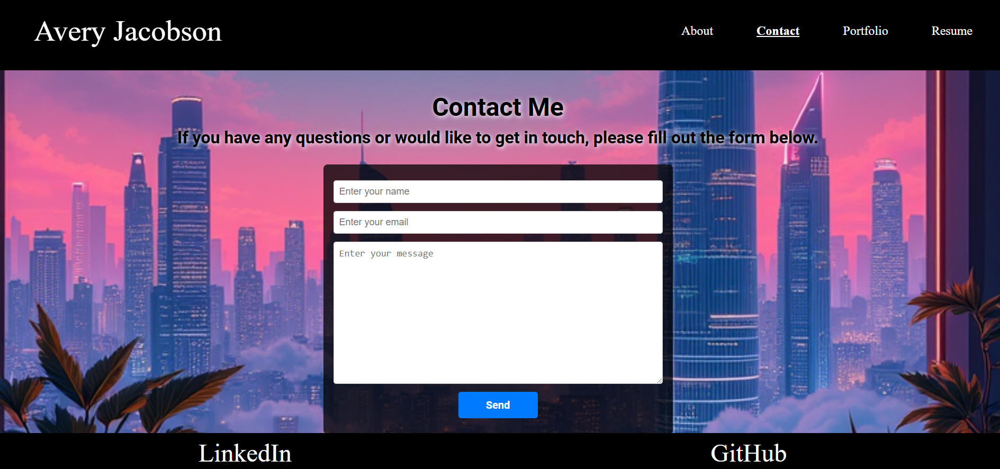
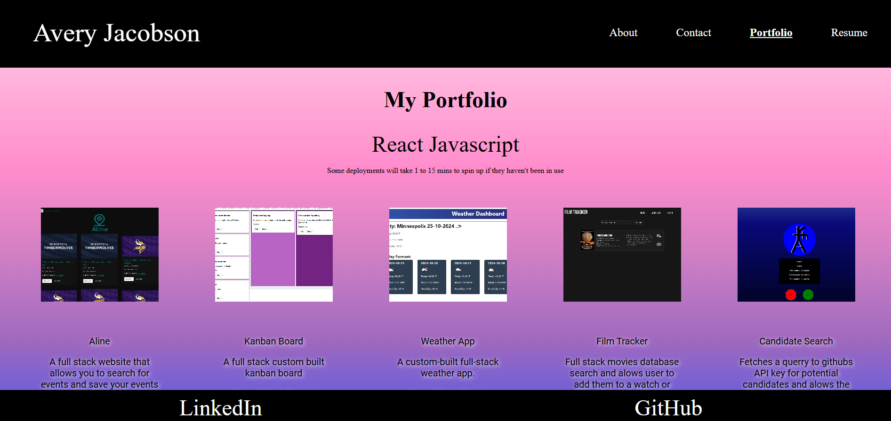
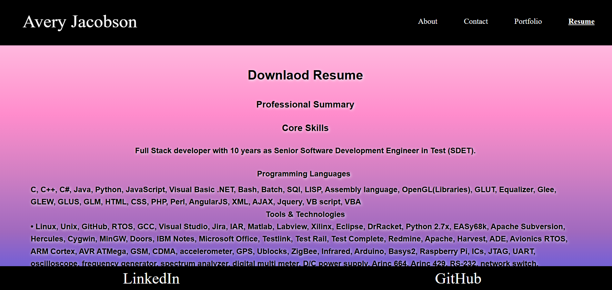

# React Portfolio

  
 

Link to deployed Site 

https://zesty-starlight-a7d6e2.netlify.app/

## Description 

This project is a responsive and visually appealing portfolio website built with React and React-Bootstrap. 
It serves as a platform to showcase projects, share professional information, and enable easy communication with visitors.

## Table of Contents  

[React](#reach)

[Description](#description)

[Table of Contents](#table-of-contents)

[Installation](#installation)

[Usage](#usage)

[License](#license)

[Contributing](#contributing)

[Tests](#tests)

[Questions](#questions)

  ## Installation  

  Open this project in your visual studio code editor. Right click the index.js file and open in terminal. Type npm init -y and npm i to install the npm dependencies. This project is also justing react, react-router-dom and bootstrap. react-router-dom has to be in your config file to use it. 

  {
  "name": "26-ins-react-router",
  "private": true,
  "version": "0.0.0",
  "type": "module",
  "scripts": {
    "dev": "vite",
    "start": "vite",
    "build": "vite build",
    "lint": "eslint src --ext js,jsx --report-unused-disable-directives --max-warnings 0",
    "preview": "vite preview"
  },
  "dependencies": {
    "bootstrap": "^5.2.3",
    "react": "^18.2.0",
    "react-dom": "^18.2.0",
    "react-router-dom": "^6.11.1"
  },
  "devDependencies": {
    "@types/react": "^18.0.28",
    "@types/react-dom": "^18.0.11",
    "@vitejs/plugin-react": "^4.0.0",
    "eslint": "^8.38.0",
    "eslint-plugin-react": "^7.32.2",
    "eslint-plugin-react-hooks": "^4.6.0",
    "eslint-plugin-react-refresh": "^0.3.4",
    "vite": "^5.1.6"
  }
}

   

  ## Usage  

  to run the project type npm run dev and click on the local host or click on the deployed link. 

   

  ## License 

  This application is covered under the following license:  

   

  [![License: MIT]] (https://opensource.org/licenses/MIT) 

   

  ## Contributing  

  n/a 

   

  ## Tests  

    Header has name and links, page height and width is competely filled by page. All links work, all documents can be download. ALl photos can be seen. If you hover over input boxes in contact me there is a message saying this field is required, if you do not put an @ in the email says invalid email. When landing on page first time about link has focus and when clicking on links the link gains focus. 

   
  ## Questions 

  Githubname: TheReal4m4d3u5

   

  https://github.com/TheReal4m4d3u5 

   

  averyajacobson@gmail.com 

## Notes
I was also tutored by Alex from the University of Minnesota on how to set up my react profile navigation. 

